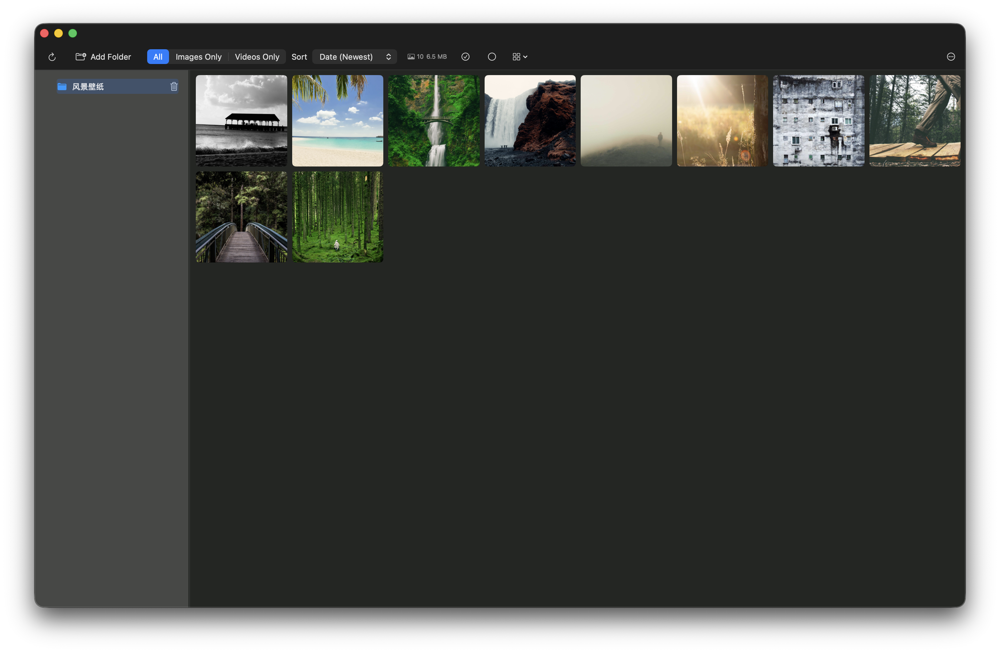

# PhotoView

轻量级 macOS 文件夹媒体浏览应用，支持查看多种图片和视频格式 | macOS photo gallery app with multi-format support

[English](#english) | [中文](#中文)

---

## English

A lightweight photo gallery application for macOS.



### Supported Formats

| Type | Formats |
|------|---------|
| Images | JPEG, PNG, GIF, HEIC, TIFF, BMP, WebP |
| Videos | MP4, MOV, MKV, M4V, AVI, WebM |

### Technical Stack

| Component | Technology |
|-----------|------------|
| Language | Swift 5.9 |
| UI Framework | SwiftUI + AppKit |
| Metadata | SQLite3 |
| Media Playback | AVFoundation + FFmpeg |
| WebM Support | WebKit |
| Thumbnails | ImageIO + FFmpeg |

### Installation

**Requirements**: macOS 14.0+

**Build & Run**:
```bash
swift build -c release
swift run PhotoView
```

Or open `Package.swift` in Xcode and press `Cmd + R`.

---

## 中文

适用于 macOS 的轻量级相册浏览应用。


### 支持格式

| 类型 | 格式 |
|------|------|
| 图片 | JPEG, PNG, GIF, HEIC, TIFF, BMP, WebP |
| 视频 | MP4, MOV, MKV, M4V, AVI, WebM |

### 技术栈

| 组件 | 技术 |
|------|------|
| 语言 | Swift 5.9 |
| UI 框架 | SwiftUI + AppKit |
| 元数据 | SQLite3 |
| 媒体播放 | AVFoundation + FFmpeg |
| WebM 支持 | WebKit |
| 缩略图 | ImageIO + FFmpeg |

### 安装与运行

**环境要求**: macOS 14.0+

**编译运行**:
```bash
swift build -c release
swift run PhotoView
```

或在 Xcode 中打开 `Package.swift`，按 `Cmd + R` 运行。

### 许可证

本项目仅供学习与个人使用。
